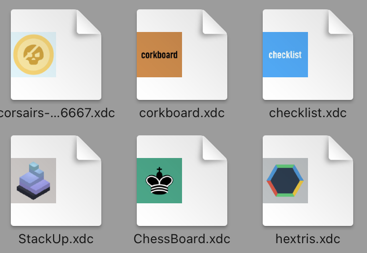
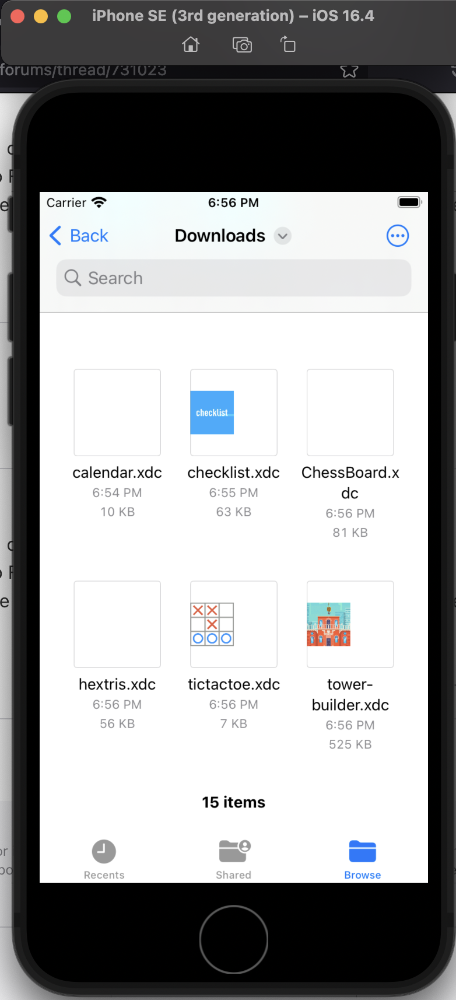

# Quicklook thumbnailing extension for webxdc files

To see webxdc app icon instead of zip file icon.

# MacOS

- seems still to be kinda slow (sometimes thumbnails are not loading fast enough in finder, sometimes it blocks other thumbnails too)
    - is it the unzipping, image loading, bad code, debug build or sth else?
- we can compile it and then put the `.appex` into a special dir in dc desktop, but maybe we need some resigning magic for it to work in the end

# iOS

To build for iOS you need to change in thumbnailing extension:
- base sdk -> to iOS
- buildphases -> link with libraries -> remove quartz framework

Note that to test changes properly on iOS, you need to install/refresh the parent app, injecting/running just the extension does not work for some reason.